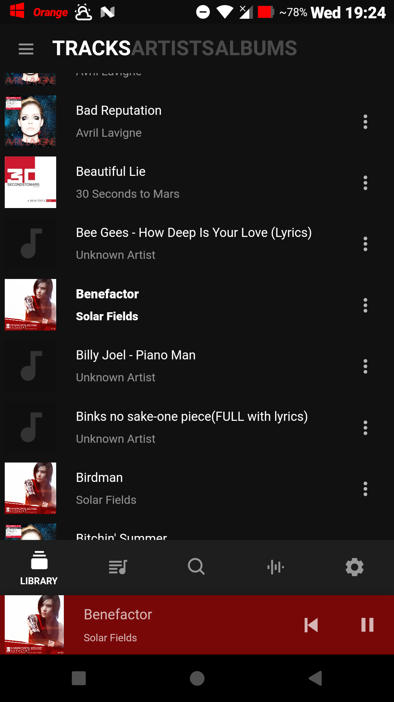
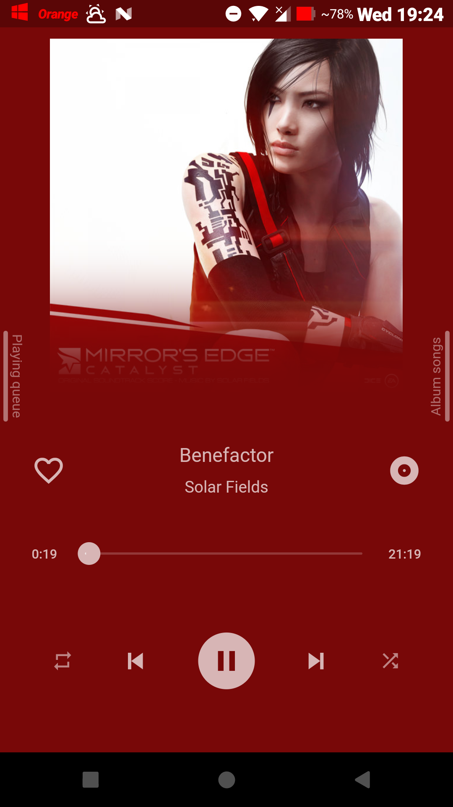
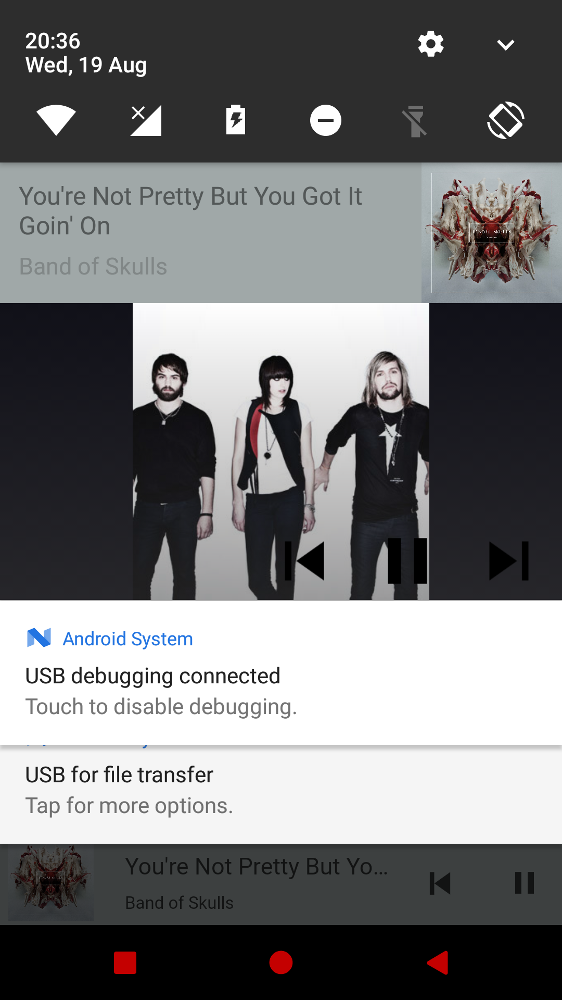

# 🎧 Flutter Music Player  

## Contact me

*email:* kadhem03@gmail.com

*Gitter:* https://gitter.im/Moda20TuneIn/community

Thank you in advance 👍

## Getting Started 🚀

- Clone the repo
- Install the dependencies by running `flutter packages get`
- Run it with `flutter run` or `flutter run -d android` for a specific platform
- You can build using `flutter build --no-tree-shake-icons` : the tree shake icons argument is a temporary thing until a fix is added in the main channel.

## Todos

- [x] Retrieve songs
- [x] Retrieve from SD
- [x] Play
- [x] Pause
- [x] Seek
- [x] Shuffle
- [x] Favorites
- [x] Album list
- [x] Playing queue
- [x] Android X migration
- [x] Notification and Lock Screen Controls
- [x] System integration
- [x] Artist list
- [x] Playlists
- [x] Search songs
- [x] Adding support for artist thumbnail update via online service (Discog Only, for the moment)
- [x] Finishing up the Settings page
- [x] upgrading performance
- [x] Adding Native Media Controls:
    - [x] Native Android Media Controls
    - [ ] Native iOS Media Controls
- [ ] Adding UPnP Casting
    - [x] UPnP
        - [x] Basic Http only casting with stable UI integration
        - [x] Full Interface and integration and testing
        - [ ] Full integration with media keys (headphones, wireless earphones, ...)
        - [ ] Implementing private access to files and moving to a HTTPS-only option
- [x] Adding a better landing page :
    - [x] Most Played & Random songs
    - [x] Top Albums
    - [x] Current Queue wheel
    - [x] Discover Artists/Albums
- [ ] FTP song registry
- [ ] Media Tags changing, Song and library management
- [ ] adding proper UI scaling
- [ ] Spotify integration

## 📸 ScreenShots
|               Track list                  |           bottom panel playing            |            Main panel playing             |              Artist List                 |
| ----------------------------------------- | ----------------------------------------- | ----------------------------------------- | -----------------------------------------|
|  |  |  | |

|              Album song list              |                ALbums List                |             Home Page                     |     Notification Big Layout Controls     |
| ----------------------------------------- | ----------------------------------------- | ----------------------------------------- | -----------------------------------------|
|  |  |  | |

## Support me

You can support me by:

⭐️ this repo if you like it.

Buy me a cup of coffee ☕️:

*NOT there yet*

